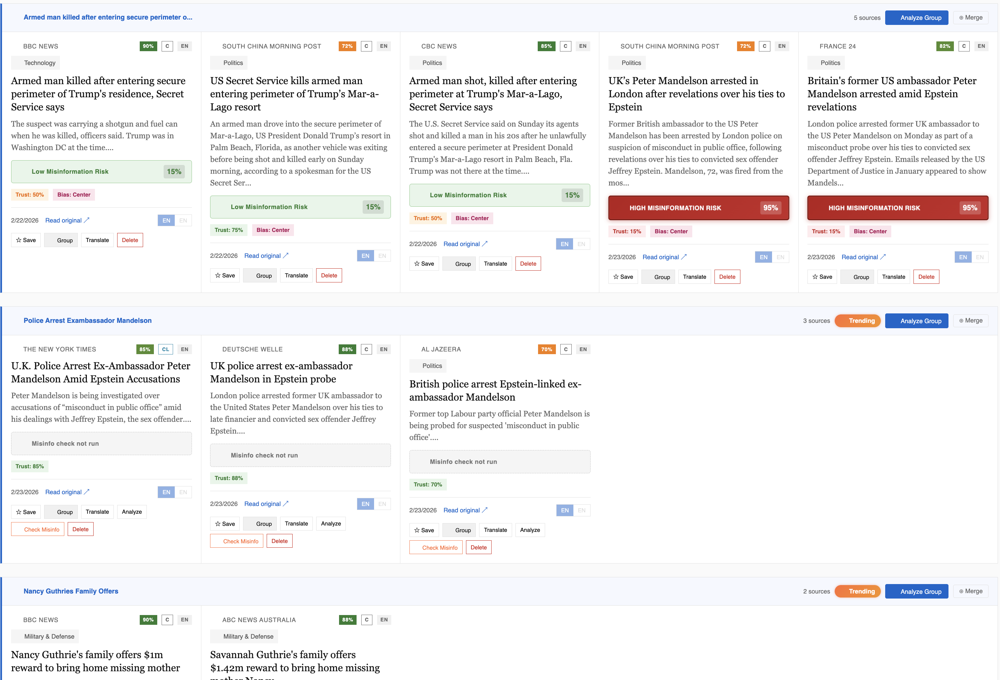
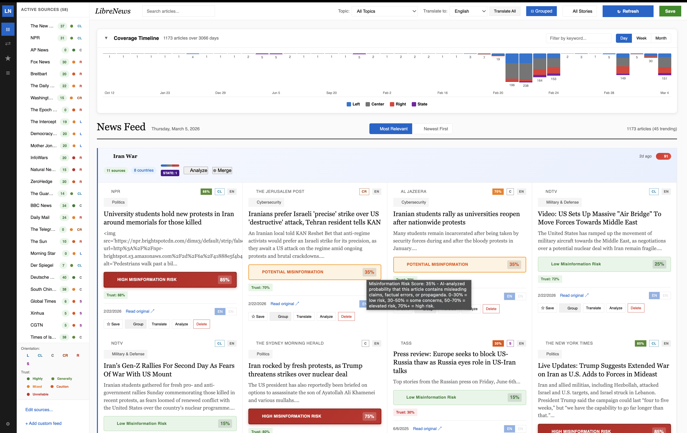
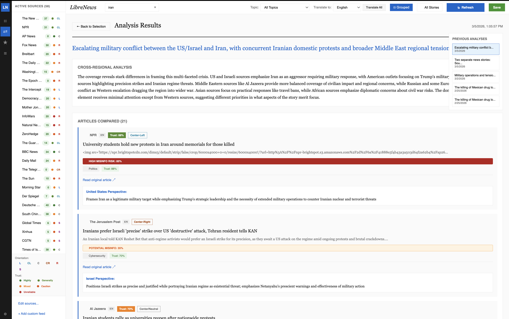
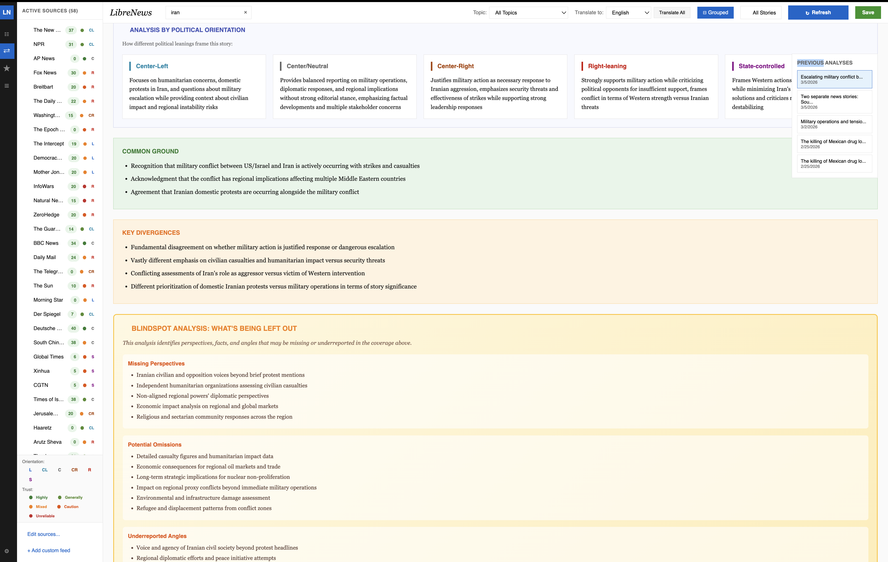
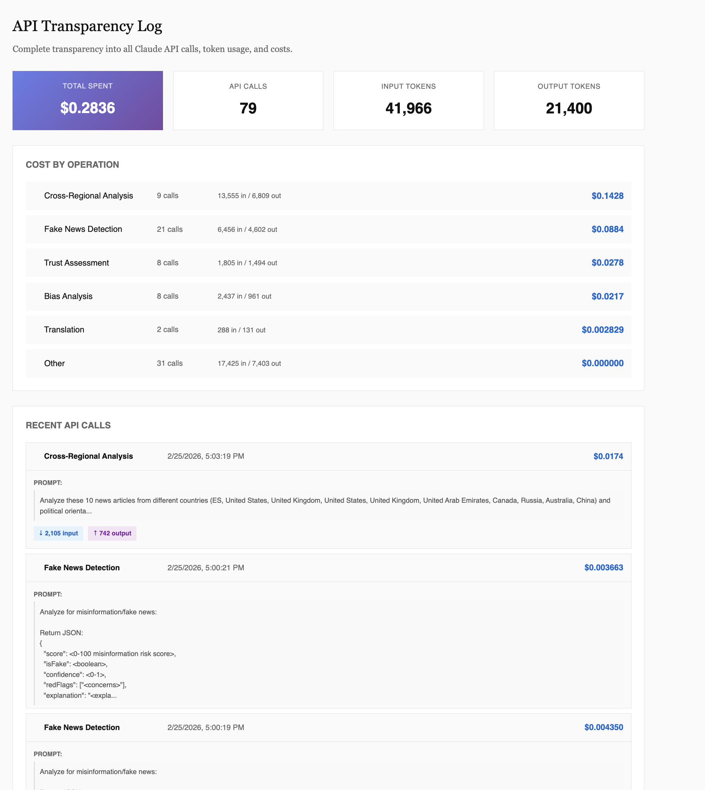
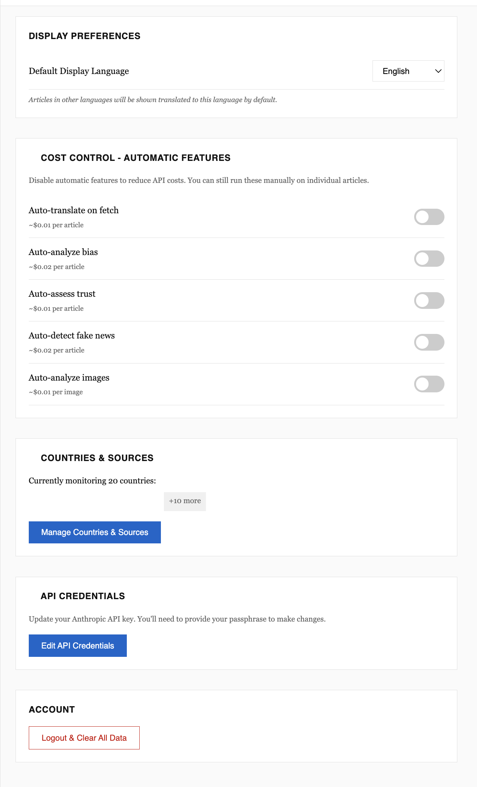

# LibreNews

**AI-Powered Cross-Regional News Analysis**

LibreNews is an open-source desktop application that helps users understand how news stories are covered differently across countries, political orientations, and media sources. By aggregating news from multiple international sources and leveraging AI analysis, LibreNews empowers users to see beyond their local media bubble and develop a more nuanced understanding of global events.

*Last updated: March 5, 2026*

## Screenshots

### News Feed with Coverage Timeline
Browse articles with an interactive timeline showing coverage distribution over time. Filter by date range, sort by relevance or recency, and see political spectrum distribution at a glance.



### News Feed - Grouped by Story
Related articles from different sources are automatically grouped together with coverage spectrum bars, blindspot alerts, and importance scores. Each group shows political distribution and source diversity.



### Cross-Regional Analysis
Select articles from different countries and political orientations to run AI-powered comparative analysis. Includes suggested analyses sorted by relevance or recency, with blindspot detection.





### API Transparency Log
Full visibility into every AI operation, including token usage, costs, and monthly budget tracking. Know exactly what you're spending with pay-as-you-go support.



### Settings & Configuration
Configure API credentials, cost controls, source categories, and manage your news sources.



## Motivation

In an era of increasing media fragmentation and polarization, it's more important than ever to understand how the same story can be framed differently depending on who's telling it. LibreNews was born from the belief that:

- **Transparency matters**: Users should see exactly how AI analyzes their news, including full cost transparency for API usage
- **Multiple perspectives lead to better understanding**: Comparing coverage from different countries and political orientations reveals biases that single-source consumption cannot
- **Privacy is non-negotiable**: Your API keys are encrypted locally with AES-256, and your reading habits stay on your machine
- **Open source enables trust**: Anyone can audit how the analysis works and contribute improvements

## Features

### News Aggregation
- Fetch articles from curated RSS feeds across multiple countries
- Add custom RSS feeds from any source
- Automatic feed validation before adding new sources
- Topic detection and categorization (Politics, Business, Technology, etc.)

### Cross-Regional Analysis
- Compare how the same story is covered by different countries
- Analyze perspectives by political orientation (Left, Center, Right, State-affiliated)
- Identify common ground and key divergences between sources
- Automatic grouping of related articles with smart cluster naming
- **Blindspot Analysis**: Identify missing perspectives and underreported angles

### AI-Powered Insights
- **Bias Analysis**: Detect political lean in article framing
- **Trust Assessment**: Evaluate source reliability and fact-check records
- **Fake News Detection**: Flag potential misinformation with prominent warnings
- **Image Analysis**: Check images for manipulation or misleading content
- **Translation**: Translate articles to your preferred language
- **Blindspot Detection**: Identify when coverage is one-sided or missing perspectives

### Coverage Analysis (Ground.news-inspired)
- **Coverage Spectrum Bar**: Visual representation of political distribution (Left/Center/Right/State)
- **Blindspot Alerts**: Warnings when stories lack coverage from certain political perspectives
- **Importance Scoring**: Stories ranked by coverage breadth, geographic spread, and political diversity
- **Interactive Timeline**: Filter articles by date range with visual coverage distribution
- **Source Diversity Badges**: See how many sources and countries cover each story

### User Experience
- Clean, newspaper-inspired interface
- Group related stories automatically or manually
- Merge article groups covering the same topic
- One-click cross-regional analysis for any group
- Filter by topic, source, or trending status
- Search across all articles
- **Sort by relevance or newest first**
- **Comprehensive tooltips** explaining all metrics and indicators
- **Suggested analyses** with relevance/recency sorting

### Transparency & Control
- **Full API Cost Tracking**: See exactly how much each AI operation costs
- **Monthly Budget Monitoring**: Track spending against your budget with visual progress bar
- **Cost Control Settings**: Disable automatic AI features to manage spending
- **API Transparency Log**: Review every Claude API call with token counts and costs
- **Configurable Automation**: Choose which AI features run automatically vs. on-demand
- **Source Categories**: Create custom categories to organize news sources

## Technology Stack

- **Frontend**: React + TypeScript + Vite
- **Desktop**: Electron
- **AI**: Claude API (Anthropic)
- **Storage**: IndexedDB (local, no server required)
- **Security**: AES-256-GCM encryption for API key storage

## Getting Started

### Prerequisites
- Node.js 18+
- An Anthropic API key ([get one here](https://console.anthropic.com))

### Installation

```bash
# Clone the repository
git clone https://github.com/yourusername/librenews.git
cd librenews

# Install dependencies
npm install

# Start the development server
npm run dev

# Or build the desktop app
npm run build
npm run electron:build
```

### First Run

1. Launch LibreNews
2. Enter your Anthropic API key
3. Create a passphrase to encrypt your key locally
4. Select the countries you want to monitor
5. Click "Refresh" to fetch your first batch of news

## Configuration

### Cost Control

LibreNews respects your API budget. In Settings, you can toggle automatic features:

| Feature | Default | Approximate Cost |
|---------|---------|-----------------|
| Auto-translate on fetch | Off | ~$0.01/article |
| Auto-analyze bias | Off | ~$0.02/article |
| Auto-assess trust | Off | ~$0.01/article |
| Auto-detect fake news | Off | ~$0.02/article |
| Auto-analyze images | Off | ~$0.01/image |

All features remain available on-demand even when automatic processing is disabled.

### Adding Sources

LibreNews comes with curated sources from multiple countries, but you can add your own:

1. Click "+ Add custom feed" in the sources panel
2. Enter the RSS feed URL
3. Click "Test Feed" to validate it works
4. Add a name and optionally associate it with a country

## Privacy

- **Local-first**: All data stays on your machine
- **No telemetry**: LibreNews doesn't phone home
- **Encrypted credentials**: Your API key is encrypted with your passphrase using AES-256-GCM
- **Open source**: Audit the code yourself

## Contributing

Contributions are welcome! Whether it's:

- Adding news sources for underrepresented regions
- Improving the analysis algorithms
- Fixing bugs or improving performance
- Enhancing the UI/UX
- Translating the interface

Please open an issue to discuss major changes before submitting a PR.

## License

MIT License - see [LICENSE](LICENSE) for details.

## Acknowledgments

- Built with [Claude](https://www.anthropic.com/claude) by Anthropic
- Inspired by the need for media literacy in an increasingly complex information landscape
- This project was entirely vibe-coded
- Developed with [Maestro](https://github.com/RunMaestro/Maestro/) Huge thanks to @pedramamini for this awesome environment!

---

*LibreNews: See the whole picture.*
